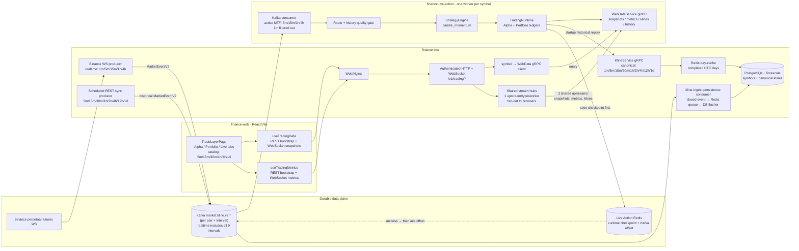
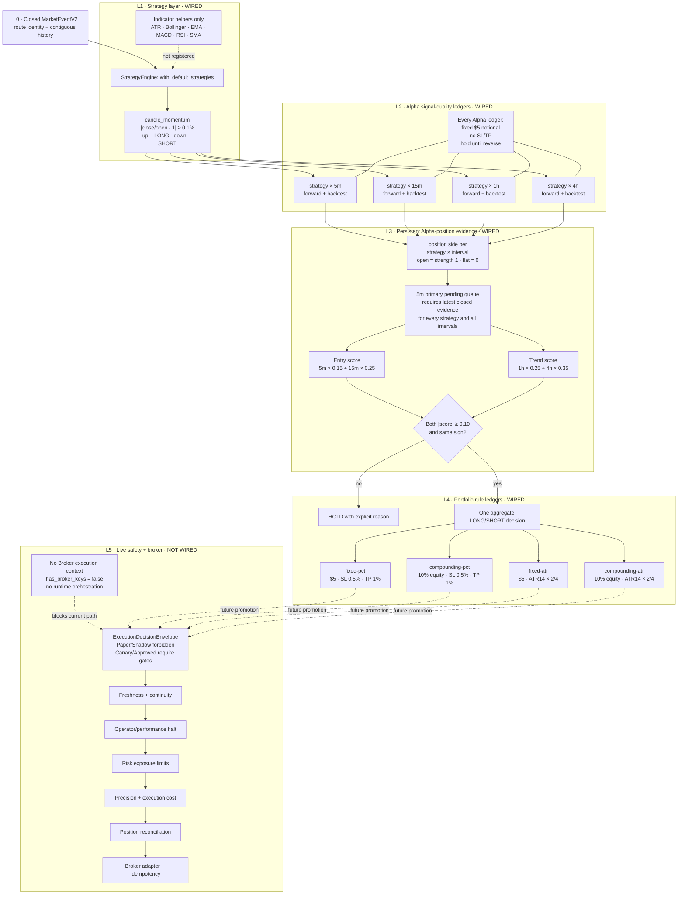
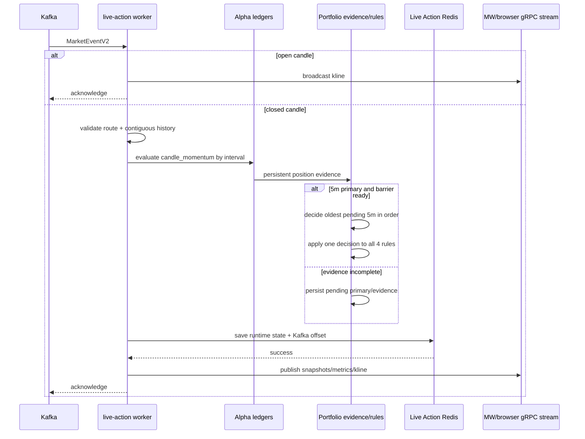

# Finance Live Action: toàn cảnh Web → Worker → DB

> Review theo code hiện tại ngày **2026-07-28**.
> File Draw.io nhiều page: [finance-live-action-workflow.drawio](finance-live-action-workflow.drawio).

## Kết luận ngắn

- Luồng **Alpha → Portfolio** đang được wire đầy đủ trong
  `finance-live-action`; **Live chưa được wire vào runtime worker**.
- Strategy mặc định đang chạy chỉ có **`candle_momentum`**. ATR, Bollinger,
  EMA, MACD, RSI và SMA là indicator helpers, không phải strategy đang được
  register.
- Mỗi worker xử lý một symbol và hiện chỉ chọn bốn interval
  `5m`, `15m`, `1h`, `4h` làm **active MTF decision bundle**. Đây không phải
  toàn bộ interval của hệ thống. Với một strategy hiện tại, worker tạo
  **17 execution contexts**: 1 runtime signal-only + 8 Alpha + 8 Portfolio.
- Portfolio không tổng hợp trực tiếp raw signal. Portfolio đọc vị thế bền vững từ từng
  Alpha ledger theo `strategy × interval`, đợi đủ barrier đa khung thời gian rồi
  áp cùng một quyết định lên bốn rule ledgers.
- Kafka là durable event log; Redis của live-action là warm checkpoint; lịch sử
  kline cho replay đến từ PostgreSQL/Timescale qua Redis day-cache của MW.
- Simulated trades hiện nằm trong worker ledger/checkpoint và được đọc bằng
  `ListHistoryTrades`; chúng chưa được ghi vào bảng `trades` của MW.

## Ký hiệu trạng thái

| Trạng thái | Ý nghĩa |
| --- | --- |
| `WIRED` | Có trên đường chạy hiện tại và được gọi từ worker/API. |
| `IMPLEMENTED, NOT WIRED` | Đã có code/domain contract nhưng runtime chưa orchestration. |
| `TARGET` | Thiết kế mong muốn; không phải cam kết production hiện tại. |

## Interval boundary: hệ thống hỗ trợ gì, strategy đang dùng gì?

`5m/15m/1h/4h` chỉ là policy hard-code của Alpha/Portfolio hiện tại. Interval được
khai báo hoặc vận chuyển ở các layer khác rộng hơn:

| Interval | MW canonical contract / storage | Binance realtime → Kafka | MW scheduled REST sync | Live-action Alpha/Portfolio | Web catalog |
| --- | :---: | :---: | :---: | :---: | :---: |
| `1m` | Có | Có | Không, đang bị comment khỏi worker list | **Không; consumer reject/filter** | Không |
| `5m` | Có | Có | Có | **Có: Entry + primary** | Có |
| `15m` | Có | Có | Có | **Có: Entry** | Có |
| `30m` | Có | Không | Có | Không | Có |
| `1h` | Có | Có | Có | **Có: Trend** | Có |
| `2h` | Có | Không | Có | Không | Không |
| `4h` | Có | Có | Có | **Có: Trend** | Có |
| `12h` | Có | Không | Có | Không | Không |
| `1d` | Có | Không | Có | Không | Có |

Ranh giới cần nhớ:

- MW protobuf, mapper và schema lưu trữ định nghĩa chín interval
  `1m/5m/15m/30m/1h/2h/4h/12h/1d`.
- Binance WebSocket ingest hiện subscribe năm interval
  `1m/5m/15m/1h/4h`, nên Kafka có cả event `1m`. Song song, scheduled REST
  sync publish `5m/15m/30m/1h/2h/4h/12h/1d` vào cùng topic để backfill.
- `finance-live-action` tạo explicit subscriptions và execution contexts cho
  đúng `5m/15m/1h/4h`; event `1m` cùng symbol vẫn bị
  `SubscriptionMismatch`. Historical replay có thể map đủ chín enum nhưng chỉ
  mở bốn stream từ `PAPER_TIMEFRAMES`.
- Web có catalog `5m/15m/30m/1h/4h/1d`, nhưng các màn kline/metrics runtime
  hiện dùng `5m/15m/1h/4h`.
- Các interval như `3m`, `6h`, `8h`, `3d`, `1w`, `1M` chưa nằm trong MW
  canonical enum nên không thuộc flow hiện tại.

## 1. Toàn cảnh end-to-end hiện tại



### Browser → MW

1. `finance-web` bootstrap state bằng REST:
   strategy weight, signal, trade state, scoped history và readiness.
2. Web mở các WebSocket snapshot/metrics/kline tới `finance-mw`, không gọi thẳng
   worker.
3. MW route theo symbol tới đúng gRPC worker.
4. Mỗi loại stream của mỗi worker chỉ có một upstream gRPC tại MW; MW cache và
   fan-out cho mọi browser. Số browser không làm tăng số stream vào worker.
5. Snapshot stream chỉ mang live state. Closed trade history lớn được tải riêng
   bằng unary `ListHistoryTrades`, có `scope_id/run_id`.

### Market data → worker

1. WebSocket producer đọc năm Binance perpetual-futures streams
   `1m/5m/15m/1h/4h`, normalize `MarketEventV2`, ghi vào Kafka topic riêng của
   từng pair và interval `market.kline.v2.{broker}.{market_type}.{base}.{quote}.{interval}`.
2. Scheduled REST Kline worker backfill tám interval
   `5m/15m/30m/1h/2h/4h/12h/1d`, normalize cùng event contract và cũng ghi
   Kafka.
3. Persistence consumer của `kline-ingest` (service/container riêng, cùng
   business domain trading với `trading-worker` nhưng tách process để
   reconnect WebSocket bị treo không làm gián đoạn job `kline_sync` định kỳ)
   nhận closed events, đưa qua Redis priority queue/DB flusher rồi lưu klines
   vào PostgreSQL/Timescale.
4. Mỗi live-action worker dùng một Kafka consumer group và filter cùng symbol ở
   active MTF bundle `5m`, `15m`, `1h`, `4h`. Event `1m` có trên Kafka nhưng
   không có subscription tương ứng nên bị bỏ; `30m/2h/12h/1d` từ scheduled sync
   cũng nằm ngoài bundle. Các symbol workers không được dùng chung group.
5. Open candle chỉ broadcast; closed candle đi qua route/history gate rồi mới
   evaluate strategy.
6. Worker cập nhật runtime, lưu checkpoint gồm state và Kafka offset vào Redis.
7. Chỉ sau khi checkpoint thành công worker mới publish update/alert và
   acknowledge Kafka delivery. Redis lỗi thì offset vẫn uncommitted.

### Historical replay

Worker khởi động replay qua `finance-mw` KlineService gRPC. MW stream dữ liệu
theo `open_at`; các ngày UTC hoàn tất được đọc từ Redis day-cache, cache miss đọc
PostgreSQL/Timescale. Bốn interval dùng bốn gRPC channel riêng rồi được merge theo
`close_time`; nếu bằng nhau thì thứ tự là `5m → 15m → 1h → 4h`. KlineService
và mapper của replay hiểu đủ chín MW intervals, nhưng runtime chỉ yêu cầu bốn
stream vì `PAPER_TIMEFRAMES` đang cố định.

## 2. Layer chi tiết trong finance-live-action



## 3. Strategy inventory

### Strategy đang active

| Strategy | Điều kiện | Output | Strength | Trạng thái |
| --- | --- | --- | --- | --- |
| `candle_momentum` | `open > 0` và `abs((close-open)/open) >= 0.001` | Dương → `EnterLong`; âm → `EnterShort` | `min(abs(price_change) / 0.01, 1.0)` | `WIRED`, strategy duy nhất trong `with_default_strategies()` |

Nếu candle body nhỏ hơn 0.1% thì strategy không emit signal. Runtime Alpha biến
“không có signal” thành `HOLD` cho candle đó; vị thế cũ vẫn giữ cho tới khi có
decision ngược chiều.

### Indicator helpers chưa phải strategy

`atr`, `bollinger`, `ema`, `macd`, `rsi`, `sma` tồn tại dưới
`finance-strategy/src/indicators`, nhưng không được register vào
`StrategyEngine`. Chúng không tạo thêm Alpha lane hay contribution trong Portfolio.

## 4. Execution context inventory

Với `S` strategies và 4 Portfolio rules:

```text
total = 1 runtime + (S × 4 intervals × 2 workflows) + (4 rules × 2 workflows)
```

Với `S = 1` hiện tại:

| Nhóm | Decision policy | Workflow | Số context | Ledger |
| --- | --- | --- | ---: | --- |
| Runtime parent | `atomic_signal` | realtime | 1 | Không simulated ledger |
| Alpha | `atomic_signal` | realtime | 4 | Một ledger cho mỗi `strategy × interval` |
| Alpha Backtest | `atomic_signal` | backtest | 4 | Replay ledger cùng lane |
| Portfolio | `weighted_ensemble` | realtime | 4 | Một ledger cho mỗi rule, primary `5m` |
| Portfolio Backtest | `weighted_ensemble` | backtest | 4 | Replay ledger cùng rule |
| **Tổng** |  |  | **17** | **16 simulated ledgers** |

Replay ledger chỉ seed forward ledger cùng lane khi forward còn untouched.
Closed-trade arrays không bị copy hai lần; reader join replay history với forward
continuation để giữ PnL/history liên tục.

## 5. Alpha rules

Mục tiêu Alpha là đo chất lượng raw signal, do đó mọi lane dùng cùng contract:

| Rule | Giá trị |
| --- | --- |
| Partition | Một ledger độc lập cho mỗi `strategy × interval` |
| Active MTF intervals | `5m`, `15m`, `1h`, `4h`; không phải toàn bộ MW interval universe |
| Position sizing | `FixedNotional(5.0)` |
| Protective levels | `None` |
| Exit | Giữ tới decision ngược chiều |
| Reversal | Đóng và mở chiều mới ngay trên cùng candle |
| Evidence gửi Portfolio | Vị thế hiện tại trong persistent Alpha ledger; open strength `1`, flat `0` |

Alpha không có SL/TP vì thêm stop rule vào đây sẽ đo rule thay vì đo signal.

## 6. Portfolio multi-timeframe gate

### Barrier và weighting

| Interval | Role | Weight | Evidence boundary |
| --- | --- | ---: | --- |
| `5m` | Entry + primary decision clock | 0.15 | Latest fully closed 5m candle |
| `15m` | Entry | 0.25 | Latest fully closed 15m candle |
| `1h` | Trend | 0.25 | Latest fully closed 1h candle |
| `4h` | Trend | 0.35 | Latest fully closed 4h candle |

Strategy weight là `1 / strategy_count`. Gate chỉ pass khi:

1. đủ evidence của mọi strategy trên cả bốn interval;
2. không có future, stale hoặc sai closed-candle boundary;
3. `abs(entry_score) >= 0.10`;
4. `abs(trend_score) >= 0.10`;
5. entry và trend cùng dấu.

Nếu fail, decision là `HOLD` với reason cụ thể:

- `future_timeframe_evidence:<interval>`
- `missing_timeframe_evidence:<interval>`
- `missing_strategy_evidence:<interval>:<strategy>`
- `stale_timeframe_evidence:<interval>`
- `unsynchronized_timeframe_evidence:<interval>`
- `entry_score_below_threshold`
- `trend_score_below_threshold`
- `entry_trend_conflict`

Evidence close hỗ trợ cả timestamp exact boundary và inclusive exchange close
`boundary - 1ms` (`...999ms`).

### Bốn Portfolio rules đang active

Một aggregate decision được chạy trên **tất cả** rule ledgers:

| Lane | Sizing | Stop loss | Take profit | ATR warm-up |
| --- | --- | ---: | ---: | --- |
| `fixed-pct` | Fixed notional `$5` | `0.5%` entry | `1.0%` entry | Không |
| `compounding-pct` | `10%` current equity | `0.5%` entry | `1.0%` entry | Không |
| `fixed-atr` | Fixed notional `$5` | `2 × ATR(14)` | `4 × ATR(14)` | Có, chưa đủ ATR thì chưa mở |
| `compounding-atr` | `10%` current equity | `2 × ATR(14)` | `4 × ATR(14)` | Có, chưa đủ ATR thì chưa mở |

Simulation contract dùng chung:

- starting equity `10,000`;
- fee `5 bps` mỗi fill/side;
- slippage `2 bps` mỗi fill/side;
- funding mặc định `1 bp` mỗi mốc 8 giờ (`00:00`, `08:00`, `16:00` UTC);
- protective exit được xét trước directional reversal;
- nếu stop và take cùng chạm trong một candle thì stop thắng;
- reversal đóng rồi mở chiều mới ngay cùng candle.

## 7. Event ordering, checkpoint và replay



Checkpoint giữ recent klines, signal states, mọi simulated ledger, Portfolio evidence,
pending 5m primaries, last processed primary, replay completion/continuation và
Kafka offset. Replay semantics được version bởi
`HISTORICAL_REPLAY_CONTRACT_VERSION = 7`; mismatch làm bỏ replay ledger/completion
cũ để rebuild theo contract mới.

## 8. Live layer: code đã có nhưng runtime chưa nối

Không có Live/Broker execution context được tạo trong `TradingRuntime`; API state
hiện khởi tạo `has_broker_keys = false`. Vì vậy UI có thể hiểu shape của Live
lane nhưng worker hiện không phát ra lane đó.

| Domain contract | Rule đã encode | Runtime status |
| --- | --- | --- |
| `execution_decision` | Stages: OfflineBacktest, Paper, LiveShadow, CappedCanary, ApprovedLive; Paper/Shadow cấm broker submit; Canary/Approved bắt buộc safety gates; versioned idempotency identity | `IMPLEMENTED, NOT WIRED` |
| `execution_freshness` | Freshness + sequence continuity cho market data, broker account, risk, cost, ledger và reconciliation cursors | `IMPLEMENTED, NOT WIRED` |
| `execution_halt` | Fail-closed global/broker/account/symbol halt; operator kill, dependency unavailable; preserve hoặc close-at-market; admin reset | `IMPLEMENTED, NOT WIRED` |
| `performance_halt` | Daily/rolling loss, loss fraction, drawdown, consecutive loss, strategy failure | `IMPLEMENTED, NOT WIRED` |
| `risk` | Max order notional, max 10% emergency order/equity ceiling, symbol/account gross/net, leverage, open orders, snapshot freshness | `IMPLEMENTED, NOT WIRED` |
| `execution_cost` | Tick/step precision, min/max quantity/notional, fee/spread/slippage/impact/latency/commission/funding/borrow và total cost budget | `IMPLEMENTED, NOT WIRED` |
| `position_reconciliation` | Reconcile local from broker, adopt broker position, resolve local missing at broker | `IMPLEMENTED, NOT WIRED` |
| `finance-broker` adapter | Binance order adapter + Redis idempotency | Standalone; chưa được `finance-api` orchestration |

Lưu ý: adapter hiện dùng Binance Spot `/api/v3/order`, trong khi market-data
route production là `perpetual_future`. Không được nối thẳng adapter này để gọi
đó là Live Futures trước khi hoàn tất broker/market contract, safety orchestration
và reconciliation.

Thiết kế layer đích chi tiết hơn nằm tại
[trading-decision-pipeline-design.md](../superpowers/specs/2026-07-27-trading-decision-pipeline-design.md);
tài liệu đó là `TARGET`, không thay đổi trạng thái runtime nêu trên.

## 9. Store ownership

| Store | Dữ liệu sở hữu trong flow này | Không nên hiểu nhầm |
| --- | --- | --- |
| Kafka `market.kline.v2.*` (per-pair, per-interval) | Durable normalized market events và replay offset source | Không giữ TradingRuntime ledger |
| Live Action Redis | Worker checkpoint, runtime state, Alpha/Portfolio ledgers, pending evidence, Kafka offset; alert pub/sub | Không phải historical kline warehouse |
| MW Redis day-cache | Cache ngày UTC hoàn tất cho historical KlineService | Không phải authoritative Alpha/Portfolio state |
| MW PostgreSQL/Timescale | Symbols và historical klines; schema cũng có scopes/runs/trades | Alpha/Portfolio worker hiện chưa ghi simulated trades vào bảng `trades` |
| Browser memory | Selected scope, cached live snapshots và REST-loaded scoped history | Không phải source of truth |

## 10. Code evidence index

### finance-web / finance-mw

- Browser state:
  [`useTradingData.ts`](../../web/src/hooks/useTradingData.ts),
  [`useTradingMetrics.ts`](../../web/src/hooks/useTradingMetrics.ts),
  [`TradeLayerPage.tsx`](../../web/src/pages/TradeLayerPage.tsx)
- Interval contracts and UI profiles:
  [`enum.proto`](../../proto/enum.proto),
  [`consts.go`](../../internal/interfaces/worker/consts.go),
  [`intervals.ts`](../../web/src/constants/intervals.ts)
- Lane classification:
  [`tradingScope.ts`](../../web/src/utils/tradingScope.ts)
- HTTP/WebSocket routes:
  [`router.go`](../../internal/interfaces/http/router.go),
  [`trading_controller.go`](../../internal/interfaces/http/controllers/trading_controller.go)
- Symbol routing + shared upstream fan-out:
  [`trading_gateway.go`](../../internal/interfaces/http/trading_gateway.go),
  [`stream_hub.go`](../../internal/interfaces/http/stream_hub.go),
  [`web_data_client.go`](../../internal/interfaces/grpc/clients/web_data_client.go)
- Market ingest:
  [`binance_ws_service.go`](../../internal/services/binance_ws_service.go),
  [`writer.go`](../../pkg/kafka/writer.go)
- Historical kline:
  [`kline_service_server.go`](../../internal/interfaces/grpc/servers/kline/kline_service_server.go),
  [`repository_impl.go`](../../internal/repository/kline/repository_impl.go)

### finance-live-action

- Worker ordering:
  [`main.rs`](../../../finance-live-action/crates/finance-api/src/main.rs)
- Contexts, Alpha/Portfolio rules, evidence and checkpoint state:
  [`trading_api.rs`](../../../finance-live-action/crates/finance-api/src/trading_api.rs)
- Strategy registration and implementation:
  [`engine.rs`](../../../finance-live-action/crates/finance-strategy/src/engine.rs),
  [`candle_momentum.rs`](../../../finance-live-action/crates/finance-strategy/src/candle_momentum.rs),
  [`indicators.rs`](../../../finance-live-action/crates/finance-strategy/src/indicators.rs)
- MTF policy + simulation:
  [`trading_modes.rs`](../../../finance-live-action/crates/finance-core/src/trading_modes.rs)
- Historical replay:
  [`historical_replay.rs`](../../../finance-live-action/crates/finance-api/src/historical_replay.rs)
- gRPC contract:
  [`web_data.proto`](../../../finance-live-action/proto/web_data.proto),
  [`grpc.rs`](../../../finance-live-action/crates/finance-api/src/grpc.rs)
- Live safety contracts:
  [`execution_decision.rs`](../../../finance-live-action/crates/finance-core/src/execution_decision.rs),
  [`execution_freshness.rs`](../../../finance-live-action/crates/finance-core/src/execution_freshness.rs),
  [`execution_halt.rs`](../../../finance-live-action/crates/finance-core/src/execution_halt.rs),
  [`performance_halt.rs`](../../../finance-live-action/crates/finance-core/src/performance_halt.rs),
  [`risk.rs`](../../../finance-live-action/crates/finance-core/src/risk.rs),
  [`execution_cost.rs`](../../../finance-live-action/crates/finance-core/src/execution_cost.rs),
  [`position_reconciliation.rs`](../../../finance-live-action/crates/finance-core/src/position_reconciliation.rs)

## 11. Gaps cần giữ visible

1. Live safety modules chưa được ghép thành một fail-closed orchestration path.
2. Broker credential ownership nằm ở MW nhưng worker hiện không nhận/use account
   context; key status vẫn false.
3. Broker adapter hiện là Spot, không khớp perpetual-future production route.
4. Simulated trades chưa durable trong MW PostgreSQL; durability hiện phụ thuộc
   worker Redis checkpoint và replay.
5. Thêm strategy mới làm tăng Alpha contexts theo `8 × strategy_count` và buộc
   Portfolio barrier phải có evidence của strategy đó trên đủ bốn interval.
6. Mọi thay đổi replay semantics phải bump
   `HISTORICAL_REPLAY_CONTRACT_VERSION` và giữ replay/forward continuation cùng
   lane.
7. Active MTF intervals đang được hard-code đồng thời trong worker subscriptions,
   metrics validation, context construction và replay selection. Muốn thêm `1m`,
   `30m` hoặc interval khác phải thiết kế role/weight/primary-clock và migration
   checkpoint/replay; chỉ thêm stream ingest là chưa đủ.
