# Pipeline observability và analytics

Trạng thái: kiến trúc đích đã được duyệt để lập kế hoạch triển khai ngày
2026-08-27. Tài liệu này không khẳng định pipeline Kafka đã được triển khai.
Cho đến khi các cổng cutover trong tài liệu này đạt yêu cầu, pipeline
JSONL/Filebeat hiện tại vẫn là pipeline production.

## Quyết định kiến trúc

Log vận hành của mọi dịch vụ Finance sẽ dùng Kafka làm tầng vận chuyển bền vững
và bộ đệm replay. Một pipeline consumer chuyên trách sẽ kiểm tra, làm sạch, bổ
sung metadata và phân phối event. Elasticsearch/OpenSearch là lớp tìm kiếm log
tương tác; ClickHouse là lớp phân tích khối lượng lớn cho log, thống kê vận hành
và thống kê trading phục vụ tối ưu chiến thuật; S3-compatible object storage là
kho lưu trữ dài hạn và nguồn để dựng lại dữ liệu.

Ứng dụng không được publish log vận hành đồng bộ trực tiếp vào Kafka. Ứng dụng
ghi một JSON object tương thích ECS trên mỗi dòng ra stdout hoặc stderr. Agent
cục bộ trên node đọc stream do runtime quản lý, cung cấp disk buffer có giới hạn
và publish vào Kafka logging mà không đưa tính sẵn sàng của Kafka vào request
path hoặc trading execution path.

Kafka observability/analytics không được dùng chung broker, quota hoặc failure
capacity với Kafka market-data đang nằm trên trading critical path. Bên trong
cluster observability/analytics, log và analytical business event vẫn phải tách
topic, ACL, quota và consumer group. Log storm không được phép làm chậm candle,
signal, order, execution event hoặc event thống kê dùng cho research.

Thống kê tài chính không được tính bằng cách parse log. Portfolio decision,
closed trade, position, fill, fee, funding, slippage và strategy outcome phải là
business event có schema riêng, phát từ nguồn dữ liệu authoritative và không bị
sampling/drop như log chẩn đoán.

## Sơ đồ kiến trúc đích

```mermaid
flowchart LR
    subgraph Sources[Các dịch vụ Finance]
        MW[finance-mw]
        WEB[finance-web]
        LIVE[finance-live-action]
        BROKER[finance-broker]
        MT5[mt5]
    end

    subgraph Native[Native server và Docker host]
        JOURNAL[journald / Docker json-file<br/>rotate có giới hạn]
        NAGENT[Vector / Alloy agent<br/>disk buffer cục bộ]
        JOURNAL --> NAGENT
    end

    subgraph K8S[Các node Kubernetes]
        CRI[CRI container log<br/>rotate có giới hạn]
        KAGENT[Vector / Alloy DaemonSet<br/>disk buffer cục bộ]
        CRI --> KAGENT
    end

    MW --> JOURNAL
    LIVE --> JOURNAL
    BROKER --> JOURNAL
    MT5 --> JOURNAL
    WEB --> CRI
    MW -. khi chạy trên Kubernetes .-> CRI
    LIVE -. khi chạy trên Kubernetes .-> CRI

    NAGENT --> RAW[(observability.logs.raw.v1)]
    KAGENT --> RAW

    subgraph LogKafka[Kafka cluster riêng cho observability và analytics]
        RAW
        CANON[(observability.logs.canonical.v1)]
        DLQ[(observability.logs.dlq.v1)]
        STATS[(analytics.trading.events.v1)]
    end

    RAW --> PROCESSOR[log-processor consumer group<br/>kiểm tra / che dữ liệu / bổ sung metadata]
    PROCESSOR --> CANON
    PROCESSOR -->|event sai hoặc poison event| DLQ

    CANON --> INDEXER[elastic-indexer consumer group]
    CANON --> CHLOG[clickhouse-log-writer consumer group]
    CANON --> ARCHIVER[s3-archiver consumer group]
    INDEXER --> ES[(Elasticsearch / OpenSearch<br/>lớp tìm kiếm hot)]
    CHLOG --> CH[(ClickHouse<br/>log analytics + trading stats)]
    ARCHIVER --> S3[(S3-compatible storage<br/>kho dài hạn dạng nén)]

    LIVE -->|Portfolio decision / trade fact| STATS
    BROKER -->|execution / fill fact| STATS
    STATS --> CHSTATS[clickhouse-stats-writer consumer group]
    STATS --> STATSARCHIVE[analytics-s3-archiver consumer group]
    CHSTATS --> CH
    STATSARCHIVE --> S3

    ES --> KIBANA[Kibana / OpenSearch Dashboards]
    ES --> GRAFANA[Grafana]
    CH --> GRAFANA
    CH --> RESEARCH[Research / feature discovery<br/>strategy optimization]
    S3 --> REBUILD[Công cụ replay / reindex]
    REBUILD --> ES
    REBUILD --> CH
```

<!-- markdownlint-disable MD013 -->



<!-- markdownlint-enable MD013 -->

Các vai trò consumer có thể nằm trong một repository và một deployable image,
nhưng phải chạy thành các process và Kafka consumer group độc lập. Thiết kế này
ngăn sự cố Elasticsearch, ClickHouse hoặc S3 chặn sink còn lại. Nhánh stats tách
khỏi nhánh log để dữ liệu research không phụ thuộc vào chất lượng log vận hành.

## Tracing có đường lưu vào ClickHouse

<!-- markdownlint-disable MD013 -->

```mermaid
flowchart LR
    APP[OpenTelemetry SDK trong ứng dụng] -->|OTLP| AGENT[OTel Collector trên node hoặc sidecar]
    AGENT -->|OTLP| GATEWAY[OTel Collector gateway<br/>persistent sending queue]
    GATEWAY --> TEMPO[Tempo]
    TEMPO --> TS3[(S3-compatible trace storage)]
    GATEWAY -->|OTLP Kafka exporter| TRACES[(observability.traces.v1)]
    TRACES --> CHWRITER[clickhouse-trace-writer<br/>consumer group]
    TRACES --> TARCHIVE[trace-s3-archiver<br/>consumer group]
    CHWRITER --> CH[ClickHouse<br/>raw span + trace analytics]
    TARCHIVE --> TS3

    APP -. ECS log có trace.id và span.id .-> LOGS[Pipeline log Kafka]
    LOGS --> SEARCH[Elasticsearch / OpenSearch]
    LOGS --> CH
    SEARCH -. liên kết dữ liệu .-> TEMPO
    CH -. drill-down theo trace.id .-> TEMPO
```

<!-- markdownlint-enable MD013 -->

Log là bằng chứng độc lập, không thay thế trace. Mỗi log phát sinh trong active
span mang `trace.id` và `span.id`, cho phép operator tìm log liên quan khi trace
bị sampling, đến trễ hoặc mất một phần. OpenTelemetry Collector phải dùng
persistent queue để sự cố Tempo hoặc Kafka tạm thời không làm mất span ngay lập
tức. OTel Collector dual-publish trace: Tempo giữ trải nghiệm trace/drill-down
hiện tại, còn `observability.traces.v1` cung cấp raw span cho ClickHouse và S3.
ClickHouse dùng raw span để phân tích latency/error theo service, version,
instrument, strategy và kết quả giao dịch. Trace, log và trading stats dùng
topic, schema, quota, retention và consumer group riêng; `trace.id` là khóa liên
kết, không phải lý do để trộn ba loại payload.

Tempo và ClickHouse cùng giữ trace trong giai đoạn đầu có chủ đích: Tempo tối ưu
cho điều tra một trace cụ thể, ClickHouse tối ưu cho aggregation trên nhiều
triệu span và join logic với thống kê. Chỉ được retire Tempo bằng một quyết định
kiến trúc và migration riêng sau khi UI, retention, sampling, replay và chi phí
đã được chứng minh tương đương.

## Trách nhiệm của từng thành phần

### Ứng dụng

- Ghi đúng một JSON object trên mỗi dòng.
- Gửi level thấp hơn `ERROR` ra stdout và `ERROR` trở lên ra stderr.
- Không chờ Kafka, Elasticsearch, ClickHouse, S3 hoặc telemetry collector trước
  khi hoàn tất nghiệp vụ không yêu cầu durable business event.
- Không ghi credential, authorization/cookie header, token, request body,
  account secret hoặc query string của URL.
- Có field liên kết observability nhưng không thêm logging metadata vào payload
  chuẩn của market-data hoặc trading.
- Business event phục vụ thống kê phải đi qua publisher/outbox có retry và
  idempotency riêng; không được giả lập business event bằng cách đọc lại stdout.

### Agent thu thập cục bộ trên node

- Chạy một instance trên mỗi native host và dưới dạng DaemonSet trên Kubernetes.
- Đọc journald, Docker hoặc CRI log và bổ sung runtime metadata mà ứng dụng
  không thể biết chắc, gồm host, node, namespace, pod, container và immutable
  image revision.
- Dùng persistent disk buffer có giới hạn, retry có giới hạn và jitter.
- Chỉ publish vào Kafka cluster riêng cho logging.
- Lọc secret/PII bước đầu trước khi dữ liệu rời node.
- Xử lý backpressure cục bộ mà không block ứng dụng. Khi áp lực lưu trữ bắt buộc
  phải bỏ dữ liệu, bỏ event `DEBUG`/`INFO` đã sampling trước `WARN`/`ERROR` và
  event security/audit; đồng thời expose metric đếm event bị bỏ.
- Không xem file `/data/log` do ứng dụng quản lý là nguồn lưu trữ bền vững.
  Retention của journald/Docker/CRI do runtime quản lý là fallback ngắn hạn trên
  máy cục bộ.

### Log processor

- Consume `observability.logs.raw.v1` bằng consumer group
  `observability-log-processor-v1`.
- Kiểm tra schema và timestamp, chuẩn hóa level, che field bị cấm và bổ sung
  environment cùng deployment identity.
- Giữ nguyên `event.id` từ producer; không tạo ID khác ở mỗi lần retry.
- Publish event hợp lệ vào `observability.logs.canonical.v1` và chỉ commit raw
  offset sau khi Kafka xác nhận canonical event.
- Publish event không hợp lệ cùng mô tả lỗi có giới hạn vào
  `observability.logs.dlq.v1`; DLQ record không được lặp lại secret đã phát hiện.
- Không retry vô hạn một poison event hoặc làm kẹt phần còn lại của partition.

### Elasticsearch/OpenSearch indexer

- Consume canonical event bằng consumer group
  `observability-elastic-indexer-v1`.
- Dùng bulk write với batch size, request timeout, exponential backoff và số
  batch trong memory đều có giới hạn.
- Dùng `event.id` làm document `_id`, giúp replay và cơ chế at-least-once có
  tính idempotent.
- Chỉ commit offset sau khi đã kiểm tra toàn bộ kết quả bulk được xác nhận. Chỉ
  retry item có thể retry; chuyển mapping failure vĩnh viễn sang DLQ.
- Xem search index là projection có thể dựng lại, không phải bản sao duy nhất.

### ClickHouse writers

- `clickhouse-log-writer` consume `observability.logs.canonical.v1` bằng consumer
  group `observability-clickhouse-log-writer-v1` để phục vụ aggregation log,
  error rate, latency, service/version comparison và liên kết theo `trace.id`.
- `clickhouse-stats-writer` consume `analytics.trading.events.v1` bằng consumer
  group `analytics-clickhouse-stats-writer-v1` để lưu fact phục vụ Portfolio
  statistics, research và strategy optimization.
- `clickhouse-trace-writer` consume `observability.traces.v1` bằng consumer group
  `observability-clickhouse-trace-writer-v1` để lưu raw span và dựng trace
  aggregate phục vụ phân tích latency/error trên tập dữ liệu lớn.
- Ba writer dùng table, schema, quota và retry queue độc lập. ClickHouse lỗi ở
  một nhánh không được làm chậm hai nhánh còn lại.
- Insert theo batch có giới hạn về số event, byte, thời gian và request timeout.
  Chỉ commit Kafka offset sau khi ClickHouse xác nhận batch.
- Mỗi analytical business event có khóa idempotency ổn định. Replay cùng một
  topic/partition/offset hoặc cùng `event.id` không được làm tăng PnL, trade
  count hoặc decision count lần thứ hai.
- Raw fact là append-only. Aggregate hoặc materialized view có thể dựng lại từ
  raw fact/S3; dashboard không được ghi ngược vào raw table.
- Query phục vụ research phải ghi lại dataset version, event-time watermark,
  strategy version, deployed SHA và bounded UTC time range để tránh so sánh hai
  tập dữ liệu khác nhau mà không biết.
- Raw span dùng `trace.id + span.id` làm identity ổn định khi replay. Span table
  không dùng chung primary identity hoặc retention với log/trading fact table.

### S3 archiver

- Consume canonical event bằng consumer group
  `observability-s3-archiver-v1`.
- Ghi object immutable dạng nén, ưu tiên Parquet sau khi canonical schema ổn
  định. JSON Lines nén Zstandard được chấp nhận ở lần rollout đầu.
- Chia object theo environment, service, ngày UTC và giờ. Tên object còn chứa
  Kafka topic, partition và khoảng offset.
- Chỉ commit offset sau khi object write được xác nhận bền vững.
- Giữ đủ offset metadata để phát hiện object chồng lấn khi replay. Duplicate
  event vẫn an toàn vì downstream index dùng `event.id` làm khóa.
- Nhánh `analytics-s3-archiver` lưu business event thống kê độc lập với object
  log, dùng consumer group `analytics-s3-archiver-v1`. Log retention không được
  xóa nguồn fact cần để tái tạo thống kê hoặc dataset research.
- Nhánh `trace-s3-archiver` lưu `observability.traces.v1` độc lập để có thể
  rebuild bảng raw span trong ClickHouse mà không phụ thuộc retention của Tempo.

## Contract của event

Canonical event là JSON tương thích ECS. Các field bắt buộc:

| Field | Yêu cầu |
| --- | --- |
| `@timestamp` | Event time theo RFC 3339 UTC |
| `event.id` | UUID duy nhất của event gốc và không đổi qua các lần retry |
| `event.dataset` | Dataset ổn định, ví dụ `finance-mw.application` |
| `log.level` | Level chữ thường đã chuẩn hóa |
| `message` | Nội dung dễ đọc, không chứa secret |
| `service.name` | Định danh dịch vụ ổn định |
| `service.environment` | `production`, `staging` hoặc `development` |
| `service.instance.id` | Định danh duy nhất của process/container instance |
| `service.version` | Git SHA hoặc image revision bất biến |
| `host.name` hoặc `k8s.node.name` | Định danh node thực thi |
| `trace.id` | W3C ID gồm 32 ký tự hex thường khi có liên kết |
| `span.id` | W3C ID gồm 16 ký tự hex thường khi có liên kết |

HTTP log dùng thêm `http.request.id`. gRPC log dùng `rpc.request.id`. Kafka
business event truyền `traceparent` và `tracestate` trong header; các header này
không thay đổi business payload.

Schema được version thông qua hậu tố topic và field `schema.version`. Thay đổi
breaking phải tạo topic version mới và có migration dual-read hoặc dual-publish.
Chỉ đổi tên topic không được xem là một kế hoạch migration schema.

## Contract event thống kê và tối ưu chiến thuật

Topic `analytics.trading.events.v1` chỉ chứa business fact có chủ sở hữu rõ
ràng. Ít nhất phải hỗ trợ các loại event sau:

- Portfolio decision candidate và kết quả `MAKE_DECISION`/`NO_DECISION`, kèm
  reason code, confidence, signal set và market regime tại event time.
- Lệnh được gửi, broker acknowledgement, fill hoặc partial fill, reject và
  cancel.
- Position open, thay đổi protective level và position close.
- Closed trade outcome gồm gross PnL, realized PnL, fee, funding, spread,
  slippage, quantity và holding duration.
- Strategy lifecycle gồm strategy/config version, model/feature version,
  instrument, broker, market, interval, trading mode, deployed Git SHA và
  experiment/cohort ID nếu có.

Mỗi event thống kê bắt buộc có:

| Field | Mục đích |
| --- | --- |
| `event.id` | Khóa idempotency ổn định của fact gốc |
| `event.type` | Phân biệt decision, order, fill, position và closed trade |
| `event.occurred_at` | Thời điểm nghiệp vụ theo UTC |
| `event.ingested_at` | Thời điểm Kafka/consumer nhận để đo độ trễ |
| `portfolio.id` | Ledger Portfolio authoritative |
| `instrument.*` | Broker, market, base/quote asset và raw symbol |
| `strategy.*` | Strategy, config, model và feature version |
| `service.version` | Immutable deployed SHA tạo event |
| `trace.id` | Liên kết về trace khi có causal trace hợp lệ |
| `source.sequence` | Sequence/ledger identity dùng phát hiện gap và replay |

`analytics.trading.events.v1` không được chứa Alpha replay order giả như
Portfolio live trade. Event phải ghi rõ `trading.mode`, nguồn ledger và cờ
historical/replay. Publisher không phát analytical fact trong quá trình khôi
phục historical state nếu fact đó đã tồn tại; consumer vẫn phải idempotent để
chặn duplicate khi process restart.

ClickHouse lưu hai lớp dữ liệu:

1. Raw fact theo event time, append-only và đủ chi tiết để audit/rebuild.
2. Derived aggregate cho daily PnL, drawdown, win rate, expectancy, fee/slippage,
   Make Decision rate, reason distribution, signal/regime breakdown, strategy
   version comparison và latency/error correlation.

Research job chỉ đọc snapshot có watermark. Kết quả optimize phải trỏ ngược về
dataset version và query/window đã dùng; không dùng aggregate chưa drain hết
Kafka lag để kết luận chiến thuật tốt hơn.

## Contract Kafka

- Dùng Kafka cluster production riêng cho observability/analytics với ít nhất
  ba broker khi yêu cầu high availability; không dùng cluster market-data trên
  trading critical path.
- Dùng replication factor 3, `min.insync.replicas=2`, producer `acks=all` và
  compression. Capacity chính xác phải dựa trên peak bytes/giây đo được, không
  chỉ dựa trên số event trung bình.
- Log partition theo `service.name + service.instance.id` để giữ thứ tự của một
  instance. Trace partition theo `trace.id` để các span của cùng trace giữ thứ
  tự tương đối. Trading stats partition theo stable Portfolio/ledger identity
  để replay đúng sequence. Không dùng một partition strategy cho cả ba signal.
- Dùng at-least-once delivery. Không giả định exactly-once trên toàn pipeline.
- Giữ raw và canonical Kafka retention đủ lâu để vượt qua khoảng search/archive
  outage dài nhất đã lên kế hoạch. Mục tiêu ban đầu là 3-7 ngày, tùy kết quả đánh
  giá disk capacity thực tế.
- Định nghĩa producer và consumer quota để một dịch vụ quá nhiều log không làm
  cạn tài nguyên cluster hoặc chặn `analytics.trading.events.v1`. Analytical
  business event có quota và cảnh báo riêng, không áp dụng sampling/drop policy
  của debug log.
- Xác thực từng producer/consumer độc lập và cấp ACL theo topic. Rotation
  credential logging không được ảnh hưởng client của market Kafka.
- Alert under-replicated partition, offline partition, disk pressure, produce
  error, consumer lag, DLQ tăng và tuổi của event chưa xử lý lâu nhất.

## Delivery và hành vi khi có sự cố

<!-- markdownlint-disable MD013 -->

| Sự cố | Hành vi mong đợi | Bằng chứng bắt buộc trước khi báo phục hồi |
| --- | --- | --- |
| Elasticsearch không sẵn sàng | Indexer tăng Kafka lag; processor và S3 archiver tiếp tục | Lag trở về baseline và các `event.id` mẫu xuất hiện đúng một lần trong index |
| ClickHouse không sẵn sàng | Ba ClickHouse writer tăng lag độc lập; ES và S3 tiếp tục | Lag từng group được drain, fact count theo offset khớp và aggregate được rebuild không nhân đôi |
| S3 không sẵn sàng | Archiver tăng lag; processor và indexer tiếp tục | Các khoảng offset thiếu đã được archive và object inventory không có gap không giải thích được |
| Kafka không sẵn sàng | Node agent giữ dữ liệu cục bộ có giới hạn và retry; ứng dụng tiếp tục | Produce thành công, local buffer được drain và counter mất event ưu tiên cao không tăng |
| Collection agent không sẵn sàng | Journal/CRI file do runtime quản lý giữ log có giới hạn | Agent tiếp tục từ checkpoint và bắt kịp runtime cursor mới nhất |
| Processor crash/restart | Kafka rebalance; replica khác tiếp tục từ committed offset | Consumer lag được drain mà không tạo duplicate canonical event theo `event.id` |
| Poison event | Processor gửi một DLQ record đã làm sạch rồi tiếp tục | DLQ alert trỏ tới topic/partition/offset và record tiếp theo vẫn được consume |
| Tempo không sẵn sàng | OTel persistent queue giữ span có giới hạn; pipeline log tiếp tục | Trace export queue được drain và log-to-trace correlation hoạt động cho request mẫu |
| Trace consumer không sẵn sàng | `observability.traces.v1` tăng lag; Tempo tiếp tục nhận trace | Lag được drain, `trace.id + span.id` không nhân đôi và span count khớp offset range |
| Mất host | Dữ liệu Kafka đã ACK vẫn còn; phần local tail chưa gửi có thể mất | Định lượng gap theo offset/thời gian và xác nhận replica/broker còn lại khỏe |

<!-- markdownlint-enable MD013 -->

Không tầng nào cung cấp buffer vô hạn. Mỗi queue và disk phải có giới hạn byte,
giới hạn tuổi dữ liệu, drop policy và alert trước khi cạn dung lượng.

## Retention và vai trò truy vấn

- Runtime-owned local log: chỉ là emergency buffer ngắn hạn có giới hạn.
- Kafka: vận chuyển và replay ngắn hạn, ban đầu 3-7 ngày.
- Elasticsearch/OpenSearch: tìm kiếm vận hành hot, ban đầu 7-30 ngày tùy capacity
  và nhu cầu query.
- ClickHouse: raw analytical fact và aggregate phục vụ stats/research. Retention
  được đặt theo nhu cầu so sánh chiến thuật và capacity; raw fact cũ có thể đưa
  xuống S3 nhưng phải còn khả năng rebuild theo dataset version.
- S3-compatible storage: kho dài hạn authoritative, có lifecycle rule cho
  warm/cold storage và thời điểm xóa cuối cùng.
- Tempo S3 storage: kho trace với retention policy độc lập.
- Kafka `observability.traces.v1`: bộ đệm replay ngắn hạn cho ClickHouse trace
  writer và trace archiver, không thay thế Tempo/S3 retention.

Kibana/OpenSearch Dashboards query lớp log search hot. Grafana có thể query cả
Elasticsearch/OpenSearch và ClickHouse. Research/optimization query ClickHouse
qua read-only identity và bounded resource quota. Công cụ replay đọc một khoảng
S3 object hoặc Kafka offset rõ ràng rồi ghi qua cùng canonical contract; công cụ
phải hỗ trợ dry-run và time range có giới hạn.

## Scale trên native host và Kubernetes

- Native server chạy một collection agent trên mỗi host dưới host supervisor.
  Agent sở hữu checkpoint và thư mục disk buffer của nó.
- Kubernetes chạy một collection agent trên mỗi node dưới dạng DaemonSet. Agent
  đọc CRI log và Kubernetes metadata mà không chèn sidecar vào từng Finance pod.
- Consumer process stateless ngoài Kafka offset và batch đang xử lý. Nhiều
  replica chạy trong cùng consumer group; số partition Kafka là giới hạn trên
  của số replica active.
- Mỗi event có `service.instance.id`, định danh host/node và deployment revision
  để phân biệt cùng một service chạy trên nhiều native host, cluster, pod hoặc
  container.
- Deployment không được dùng lại một instance ID tĩnh cho nhiều replica.

## Migration từ pipeline Filebeat hiện tại

Migration chỉ bổ sung thêm đường mới cho tới bước cutover cuối. Không xóa
Filebeat hoặc application JSONL output trước.

1. Kiểm kê event rate, dung lượng mỗi ngày, field mapping, index template,
   Filebeat input, retention và phụ thuộc query/dashboard hiện tại.
2. Provision Kafka cluster riêng cho observability/analytics và chứng minh
   replication, authentication, quota, monitoring cùng khả năng phục hồi khi
   broker lỗi.
3. Deploy node agent ở shadow mode. Giữ pipeline Filebeat hiện tại trong lúc
   agent publish event stdout/stderr tương đương vào raw topic.
4. Deploy processor, cơ chế DLQ và canonical topic. Kiểm tra schema và redaction
   bằng synthetic marker không chứa credential.
5. Deploy Elasticsearch/OpenSearch indexer vào shadow index, ClickHouse log
   writer vào shadow table và S3 archiver vào prefix tạm. So sánh count theo
   service, level và cùng bounded time window với pipeline production hiện tại.
6. Dừng từng sink consumer để tạo backlog có kiểm soát, khởi động lại và chứng
   minh replay chính xác theo Kafka offset cùng tính idempotent của `event.id`.
   Lặp lại với một lần restart processor replica.
7. Chỉ chuyển dashboard và saved search sang index alias mới sau khi query
   parity, lag, resource usage và error budget đạt yêu cầu trong soak period đã
   thống nhất.
8. Tắt Filebeat ingestion nhưng giữ đường rollback tức thời. Xác nhận log hiện
   tại từ cả native và Kubernetes instance cùng tính liên tục Kafka/S3.
9. Chỉ bỏ application-managed JSONL writer sau khi rotation của
   journald/Docker/CRI và checkpoint của node agent đã được chứng minh. Không bỏ
   local runtime buffer.
10. Chỉ retire index template, file và Filebeat resource cũ sau khi hết retention
    window và đã có backup hoặc archive có thể phục hồi.
11. Dual-publish trace từ OTel Collector vào Tempo và
    `observability.traces.v1`. Đối chiếu `trace.id + span.id`, sampling decision,
    duration và error status giữa Tempo, Kafka, ClickHouse và S3 trên cùng
    bounded time window; test backlog/replay trước khi dùng cho analytics.
12. Triển khai `analytics.trading.events.v1` độc lập với cutover Filebeat. Chạy
    publisher ở shadow mode, đối chiếu Portfolio ledger/closed trade/decision
    count với raw ClickHouse fact và S3, sau đó mới cho phép dashboard hoặc
    research dùng dataset này.
13. Dừng một stats writer, restart publisher và replay ledger có kiểm soát để
    chứng minh không nhân đôi trade, PnL hoặc Make Decision count.

Mỗi thay đổi hạ tầng tuân theo live-first lane có kiểm soát của repository;
application/consumer code do repository sở hữu phải đi qua commit, CI, Coolify
và immutable production verification. Deploy thành công chưa phải cutover thành
công nếu chưa query và replay được event thật.

## Tiêu chí nghiệm thu

Pipeline Kafka chỉ được thay pipeline Filebeat hiện tại sau khi chứng minh được
toàn bộ điều kiện sau trên production:

- Tất cả service Finance đang live và mọi native/Kubernetes instance xuất hiện
  trong canonical topic cùng search index với đúng immutable revision.
- Có thể theo một event đã biết từ runtime stream qua raw topic, canonical topic,
  search document và archived object mà không làm lộ secret.
- Có thể theo một trace mẫu từ OTel Collector qua Tempo và
  `observability.traces.v1` tới raw span trong ClickHouse/S3; replay không nhân
  đôi identity `trace.id + span.id`.
- Sự cố Elasticsearch, ClickHouse và S3 độc lập đều tích lũy rồi drain consumer
  lag mà không chặn sink còn lại hoặc ứng dụng.
- Processor restart và consumer rebalance không làm mất event; replay không tạo
  indexed document trùng.
- Kafka broker failover giữ được event ưu tiên cao đã ACK và không làm suy giảm
  market-data Kafka hoặc trading latency.
- Search count và dashboard bắt buộc đạt parity đã thống nhất với pipeline cũ
  trên cùng bounded UTC time window.
- Portfolio ledger, closed trade và decision count khớp raw fact trong
  ClickHouse theo cùng watermark; restart/replay không nhân đôi PnL hoặc count.
- Research query ghi lại dataset version, strategy version, deployed SHA,
  watermark và time range; dữ liệu còn Kafka lag không được dùng làm kết luận.
- Có alert cho broker health, local buffer pressure, producer failure, consumer
  lag, oldest event age, DLQ growth, index failure, archive failure và dropped
  event.
- Đường rollback về Filebeat cũ được ghi lại, có giới hạn và đã test trước khi
  xóa resource cũ.

## Các nội dung nằm ngoài phạm vi

- Kafka không phải kho dài hạn hoặc giao diện query chính.
- Elasticsearch/OpenSearch không phải bản durable duy nhất.
- ClickHouse không thay thế Portfolio/trade ledger authoritative và không được
  dựng thống kê tài chính bằng cách parse operational log.
- Log vận hành không dùng chung Kafka topic hoặc payload schema với business,
  market-data, signal, order hoặc execution event.
- Thiết kế không cam kết zero loss khi host, local disk, agent và Kafka cùng lỗi.
- Thiết kế không cho phép bỏ Filebeat hoặc application log file trước khi toàn
  bộ tiêu chí migration đạt yêu cầu.
